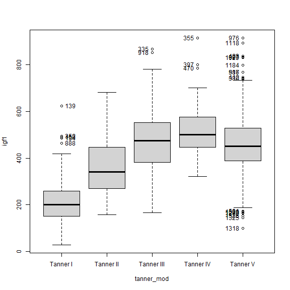
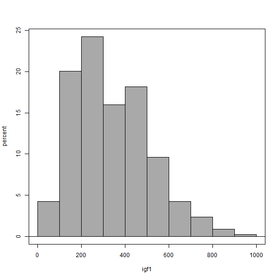
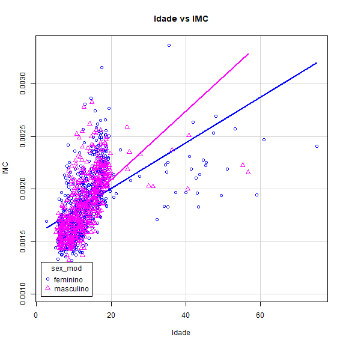

<!-- R Commander Markdown Template -->

Nada nessa merda
=======================

### Leandro Luz

### 2023-05-26


```r
> library(ISwR)
```


```r
> data(juul2, package="ISwR")
```


```r
> juul2 <- within(juul2, {
$     sex_mod <- Recode(sex, '1 = "masculino"; 2 = "feminino"', as.factor=TRUE, 
$     to.value="=", interval=":", separator=";")
$   })
```


```r
> juul2 <- within(juul2, {
$     tanner_mod <- Recode(tanner, 
$     '1 = "Tanner I"; 2 = "Tanner II"; 3 = "Tanner III"; 4 = "Tanner IV"; 5 = "Tanner V"',
$      as.factor=TRUE, to.value="=", interval=":", separator=";")
$   })
```


### Boxplot: igf1 ~ tanner_mod

```r
> Boxplot(igf1 ~ tanner_mod, data=juul2, id=list(method="y"))
```



```
 [1] "134"  "139"  "160"  "352"  "888"  "335"  "918"  "355"  "397"  "470"  "581"  "1279" "1298" "1318" "1320" "1325" "1326" "976"  "1118" "423"  "997"  "1029"
[23] "1184" "987"  "516"  "412"  "380" 
```


### Boxplot: igf1 ~ tanner_mod

```r
> Boxplot(igf1 ~ tanner_mod, data=juul2, id=list(method="none"))
```


### Histogram: igf1

```r
> with(juul2, Hist(igf1, scale="percent", breaks="Sturges", col="darkgray"))
```




```r
> juul2$IMC <- with(juul2, weight/(height)^2)
```


### Gráfico de Dispersão: IMC~age | sex_mod

```r
> scatterplot(IMC~age | sex_mod, regLine=TRUE, smooth=FALSE, boxplots=FALSE, 
$     xlab="Idade", ylab="IMC", main="Idade vs IMC", by.groups=TRUE, 
$     legend=list(coords="bottomleft"), data=juul2)
```




